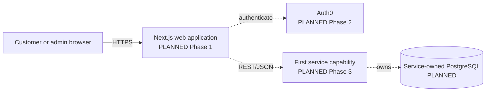
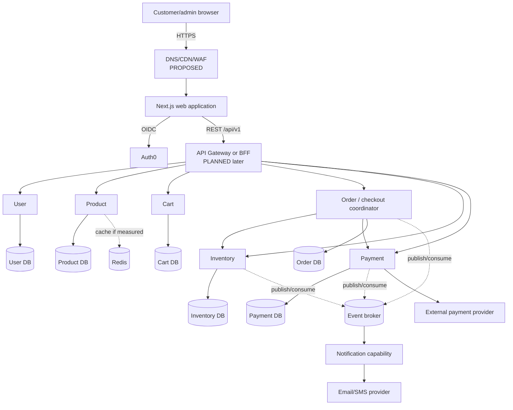
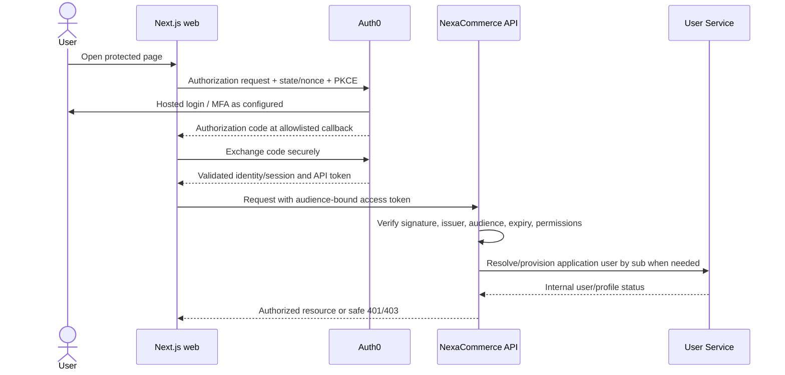
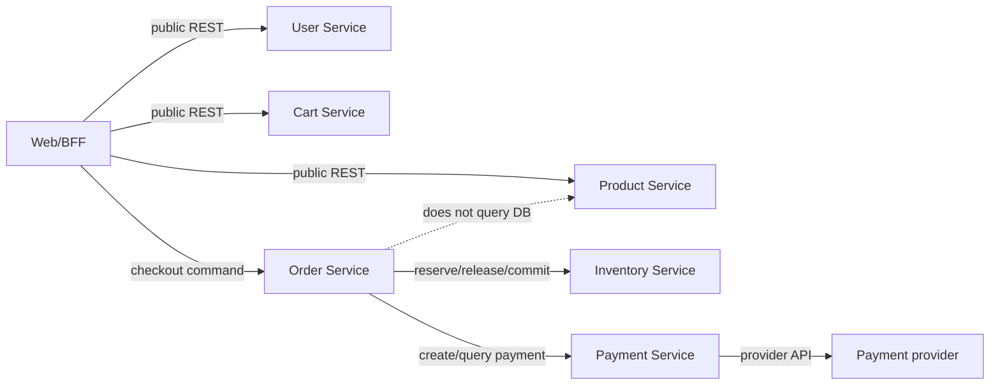
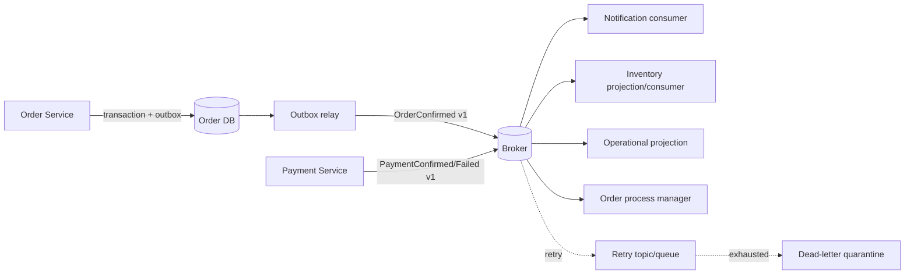
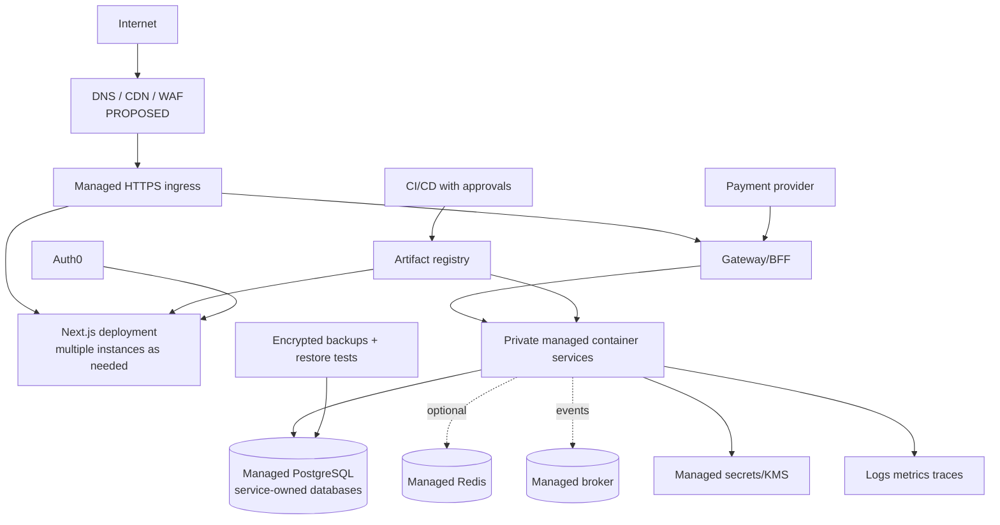

# NexaCommerce High-Level Architecture

- **Document status:** DECIDED baseline where backed by ADRs; otherwise PLANNED/PROPOSED
- **System status:** NOT YET IMPLEMENTED
- **Last reviewed:** 2026-10-02

## 1. Status vocabulary

- **DECIDED:** Accepted direction recorded here or in an ADR.
- **PLANNED:** Intended roadmap work, not yet delivered.
- **PROPOSED:** Recommended default awaiting phase-specific validation.
- **NOT YET IMPLEMENTED:** No running component or infrastructure should be inferred.

## 2. Architecture goals

The architecture must support a trustworthy purchase path, explicit business/data ownership, incremental learning, secure boundaries, and progressive operations. It must not optimize for hypothetical scale or create a deployment for every entity. The governing approach is **evolutionary coarse-grained services** (ADR-001), PostgreSQL for durable relational records (ADR-003), Auth0 for identity (ADR-002), and conditional Redis use only after a demonstrated need (ADR-004).

## 3. Current / initial architecture

### 3.1 Current state — NOT YET IMPLEMENTED

The repository contains only planning documentation and empty placeholder directories. There is no frontend, API, service, database, cache, broker, container, CI/CD pipeline, cloud resource, authentication tenant integration, or telemetry stack.

### 3.2 Initial implementation direction — PLANNED

The first runnable increments will be a Next.js TypeScript frontend, then Auth0 integration, then one backend capability at a time. REST and direct service calls are acceptable during learning while only one or two APIs exist. Each capability owns its contract and data even if local processes initially share developer infrastructure. PostgreSQL-backed functionality comes before Redis, a broker, gateway, and container platform.



This is a sequencing view, not a claim that the first service supplies the whole commerce experience.

## 4. Target / future architecture

The target is a possible mature state reached only when roadmap evidence justifies each component.



### 4.1 Frontend architecture

- **PLANNED:** Next.js with React and TypeScript, using server/client rendering deliberately by data sensitivity and interaction needs.
- Keep browser concerns (UI state, accessibility, forms) separate from server-only token/session, API composition, and secrets.
- Prefer server-side access to protected APIs through a BFF/session pattern if the Phase 2 threat model supports it; do not place long-lived bearer tokens in browser storage.
- Organize by product feature and shared design primitives, not by mirroring microservice internals.
- Public catalog pages can use appropriate rendering/caching after freshness is defined. Cart, profile, checkout, and admin data are personalized and must not leak through shared caches.
- A single web application can host customer and minimal admin routes initially; split only for independent ownership/deployment/security needs.

### 4.2 Authentication architecture

Auth0 authenticates; NexaCommerce services authorize. The User Service maps the immutable Auth0 subject to an internal user and owns commerce profile/addresses. UI route guards improve experience but are never an authorization boundary.



Exact SDK, token/session storage, refresh, logout, and provisioning are **PROPOSED** until Phase 2 validates current Auth0 guidance. CSRF, redirect, cookie, XSS, and token theft risks must be threat-modeled.

### 4.3 API architecture

- REST/JSON over HTTPS first, following `API.md`; machine-readable OpenAPI contracts are added with implementation.
- Public version boundary is `/api/v1`. A later gateway/BFF centralizes routing and coarse controls, but services remain responsible for authorization, validation, and business rules.
- Idempotency is required for checkout/payment and replay-prone writes. Optimistic concurrency protects contested admin updates.
- Internal service APIs are authenticated, time-bounded, and not publicly routable in the target deployment.
- GraphQL is not planned; it may be reconsidered only if client composition needs outweigh schema/authorization complexity.

### 4.4 Service boundaries

| Capability | Responsibility and authority | Initial boundary guidance |
|---|---|---|
| User | Application profile, addresses, application status, Auth0 subject mapping | First backend service; never owns credentials |
| Product | Product/category publication, descriptive catalog, preliminary reviews | Keep search in PostgreSQL initially; reviews remain here post-MVP |
| Cart | Active shopping intent and quantities | Price/stock snapshots are advisory |
| Order | Durable order snapshots/state and checkout coordination | Coordinates workflow initially; not inventory/payment authority |
| Inventory | Stock balances, reservations, adjustments | Separate when stock invariants are introduced |
| Payment | Provider integration, attempts, webhook deduplication/reconciliation | Isolate high-risk provider boundary; no raw card data |
| Notification | Delivery triggered by business facts | Start as capability/consumer; separate only if justified |

Services own business data and migrations. They do not join, read, or write another service database. Boundaries can be merged or split via an ADR when coupling and operational evidence warrant it.

### 4.5 Data architecture

PostgreSQL is the durable default. Logical database-per-service ownership can share a local/server cluster while credentials prevent cross-access. Cross-service references are IDs, not foreign keys. Orders store immutable purchase/address snapshots. Redis is disposable supporting infrastructure only. See `DATABASE.md`.

## 5. Communication architecture

### 5.1 Synchronous communication

Use synchronous REST when the caller needs an immediate answer to proceed: profile access, catalog reads, cart operations, and selected checkout commands. Calls require timeouts, cancellation, bounded retries only for safe transient operations, correlation context, and explicit error mapping. Avoid long request chains; compose at an edge or use read models when fan-out becomes harmful.



The last relationship is conceptual: checkout may request a versioned product/price validation API or later consume a validated projection. It never reads Product tables.

### 5.2 Order and checkout flow

This preliminary flow exposes failure points; the exact payment/reservation ordering depends on provider semantics and Phase 6–8 design.

```mermaid
sequenceDiagram
    actor C as Customer
    participant W as Web/BFF
    participant O as Order coordinator
    participant P as Product
    participant I as Inventory
    participant Pay as Payment
    participant PSP as Provider
    C->>W: Submit checkout + idempotency key
    W->>O: Create checkout
    O->>P: Validate product, publication, price
    P-->>O: Authoritative purchasable snapshots
    O->>I: Reserve quantities idempotently with expiry
    alt unavailable
        I-->>O: Reject
        O-->>W: Actionable conflict
    else reserved
        I-->>O: Reservation
        O->>Pay: Create payment attempt idempotently
        Pay->>PSP: Tokenized/hosted provider request
        alt confirmed
            PSP-->>Pay: Success
            Pay-->>O: Payment confirmed
            O->>I: Commit reservation
            O-->>W: Order confirmed
        else declined
            PSP-->>Pay: Decline
            Pay-->>O: Payment failed
            O->>I: Release reservation
            O-->>W: Declined, no false success
        else timeout or unknown
            O-->>W: Pending
            Note over O,Pay: Reconcile via query/webhook/event; retries are idempotent
        end
    end
```

A local transaction protects each service state. Compensation/reconciliation handles partial failure; there is no distributed ACID transaction.

### 5.3 Asynchronous/event-driven communication

Introduce a broker in Phase 9 for facts that do not need to block the originating request (notifications, projections, analytics) and for resilient workflow propagation where benefits exceed eventual-consistency cost. Do not use events to obscure required immediate validation.



Events are past-tense facts with owner, schema/version, event ID, aggregate ID/version, occurrence time, trace context, and minimal non-sensitive payload. Delivery is assumed at least once: consumers deduplicate, tolerate reordering where possible, and expose lag/failure. Transactional outbox prevents a committed database change from silently losing its event. Dead letters require an owned diagnosis/replay process, not passive storage.

## 6. Caching

Start without Redis. Measure browser/CDN/application/database behavior first. If introduced, define source of truth, key schema, TTL, invalidation, privacy, stampede protection, outage fallback, and hit/miss/latency/eviction signals. Catalog data is a candidate; orders, inventory, payments, and authorization decisions must not rely on stale cached truth. HTTP/CDN caching may be sufficient for public immutable/static content. See ADR-004.

## 7. External integrations

- **Auth0 — DECIDED provider category/specific default:** identity and token issuance.
- **Payment provider — PROPOSED:** compare Stripe and appropriate regional providers during Phase 8 based on target market, hosted/tokenized UX, sandbox, webhook semantics, refunds, accessibility, fees, and data residency. Never store raw card details.
- **Email/SMS — DEFERRED:** use a local/log sink initially; select provider only when notification delivery is implemented.
- **Shipping/tax/address/media — DEFERRED:** no integration until market and product requirements are known.

Every integration receives an adapter boundary, timeout/retry/idempotency policy, signature validation where applicable, secret rotation, sandbox, telemetry, data-minimization review, and documented degradation behavior.

## 8. Security boundaries

1. **Browser/edge:** untrusted input; HTTPS, secure headers/cookies, CSRF/XSS controls, narrow CORS, payload/rate limits.
2. **Identity:** Auth0 configuration and callback boundary; validate tokens, never trust claims from the browser without cryptographic/API validation.
3. **Public API edge:** coarse authentication/routing/rate limiting; not a substitute for service authorization.
4. **Service boundary:** least-privilege service identity, explicit permissions/ownership, validation, timeouts; target private networking.
5. **Data boundary:** unique service credentials, encrypted connections/storage, migration identity separation, backups, audit access.
6. **Provider boundary:** egress controls where feasible, signed webhook verification/replay defense, tokenization, secrets manager.
7. **Admin boundary:** stronger permissions, auditable mutations, optional MFA requirement before public production.
8. **Telemetry/supply chain:** redact sensitive data; pinned/reviewed dependencies, CI scanning, artifact provenance progressively.

Threat models are updated for authentication, checkout/payment, admin access, events, and deployment. A privacy/retention review is required before real user data.

## 9. Observability and reliability

Adopt progressively:

- Early phases: structured application logs, request IDs, local errors, health endpoints.
- Multiple services: propagated trace context, RED metrics (rate/errors/duration), dependency/database metrics, dashboards for critical paths.
- Events: publish/consume failures, lag, retries, dead letters, event correlation.
- Production: OpenTelemetry instrumentation, centralized logs/metrics/traces, SLOs from measured business needs, symptom-based alerts, runbooks, incident reviews, synthetic checkout, backup restore and failure exercises.

Do not log access tokens, secrets, raw payment data, or unnecessary profile/address data. Telemetry is itself access-controlled retained data.

## 10. Infrastructure and deployment

Local processes and managed emulators/sandboxes come first. Docker arrives only after services run and are understood. CI/CD, cloud resources, and production topology are later roadmap outcomes. Kubernetes is not selected; a managed container application platform is preferred initially.



Target properties: separate dev/staging/prod configuration and credentials; immutable artifacts; private data services; least-privilege identities; encrypted traffic; managed backups; health-based rollouts and rollback; infrastructure changes reviewed as code when Phase 14 selects a provider. Multi-region, service mesh, and Kubernetes are not planned without evidence.

## 11. Technology decisions not yet locked

### 11.1 Node.js backend framework

**Decision:** PROPOSED; not selected.  
**Recommendation:** Start with Fastify plus TypeScript for the first service, using explicit modules and JSON Schema/OpenAPI integration; run a small Phase 3 spike before acceptance.  
**Why:** Low overhead and comparatively little framework magic expose HTTP, validation, composition, and lifecycle fundamentals.  
**Alternatives:** NestJS offers conventions/DI and larger-service structure but adds abstractions; Express has unmatched familiarity but needs more deliberate validation/error structure; Next.js route handlers fit BFF work but should not become every independent backend by accident.  
**When we should reconsider:** If team size, framework guidance, GraphQL, transport abstractions, or repeated service scaffolding makes NestJS valuable, or runtime/platform constraints change.

### 11.2 ORM / database access

**Decision:** PROPOSED; not selected.  
**Recommendation:** Evaluate Drizzle and Prisma with a thin repository boundary; default to Drizzle if learning SQL/control is prioritized, after a migration/query spike.  
**Why:** Both provide TypeScript support; Drizzle stays close to SQL, while Prisma provides strong schema/tooling productivity. Generated migrations must be reviewed either way.  
**Alternatives:** Prisma, Kysely, node-postgres/raw SQL, TypeORM.  
**When we should reconsider:** Complex SQL, migration behavior, performance, type-generation workflow, team familiarity, or unsupported PostgreSQL features make another tool clearer.

### 11.3 Message broker

**Decision:** Deferred to Phase 9.  
**Recommendation:** Default to RabbitMQ for learning queues, routing, acknowledgements, retries, and moderate commerce workloads; validate against a managed cloud option.  
**Why:** It demonstrates messaging semantics without adopting a streaming platform before throughput/replay requirements exist.  
**Alternatives:** Kafka/Redpanda for durable high-throughput streams/replay; AWS SNS/SQS, Google Pub/Sub, or Azure Service Bus for managed cloud integration; NATS for lightweight messaging.  
**When we should reconsider:** Replay/retention/throughput, ordering, managed-provider constraints, portability, or operational skills point to a different model.

### 11.4 API Gateway

**Decision:** Deferred to Phase 10.  
**Recommendation:** Begin with a thin Next.js BFF or lightweight reverse proxy; prefer the selected cloud’s managed gateway at deployment if its cost/limits fit.  
**Why:** Avoid operating gateway infrastructure while routes are few; centralize public routing, coarse auth, limits, and observability later without moving business logic to the gateway.  
**Alternatives:** Kong, Traefik, Envoy, NGINX, cloud-managed gateways, direct service exposure (development only).  
**When we should reconsider:** Client aggregation, protocol translation, policy needs, portability, or managed gateway cost/limits justify a dedicated product.

### 11.5 Cloud provider

**Decision:** Deferred to Phase 14.  
**Recommendation:** Compare AWS, Azure, and Google Cloud against developer familiarity, free/learning budget, region, managed PostgreSQL/container/broker options, Auth0 integration, and total operational complexity; use AWS as the planning default only if no preference emerges.  
**Why:** AWS offers broad learning relevance, but choosing before budget/region constraints would create unsupported lock-in.  
**Alternatives:** Azure, Google Cloud, or simpler platforms such as Render/Fly.io where they meet security/operations needs.  
**When we should reconsider:** Budget, credits, residency, employer learning goals, service availability, or operational simplicity favor another provider.

### 11.6 Observability stack

**Decision:** Progressive and vendor-neutral initially.  
**Recommendation:** Instrument with OpenTelemetry and structured logs; use local console/dev tools first, then the chosen cloud’s managed telemetry or a managed Grafana-compatible stack.  
**Why:** Open standards preserve portability while avoiding a full self-hosted observability platform before deployment.  
**Alternatives:** Cloud-native suites, Grafana/Prometheus/Loki/Tempo, Elastic, Datadog, New Relic.  
**When we should reconsider:** Query needs, telemetry volume/cost, retention, on-call workflow, compliance, and team operational capacity are known.

## 12. Architecture governance and open decisions

Every implementation phase updates this document, API/data contracts, threat model notes, and ADRs when assumptions change. Decisions still open include target market/currency/tax/shipping, payment provider, runtime/framework, ORM, event broker, gateway, service identity, cloud, deployment compute, RPO/RTO/SLOs, and retention. A proposal becomes DECIDED only through a phase review/ADR; diagrams describe direction, not deployed inventory.
